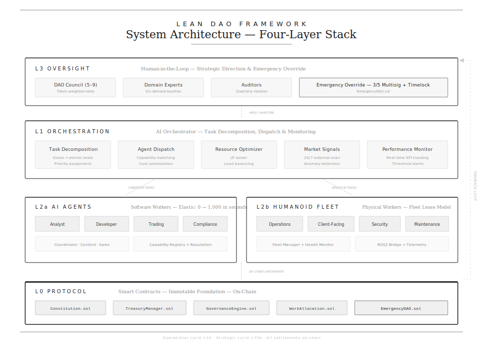
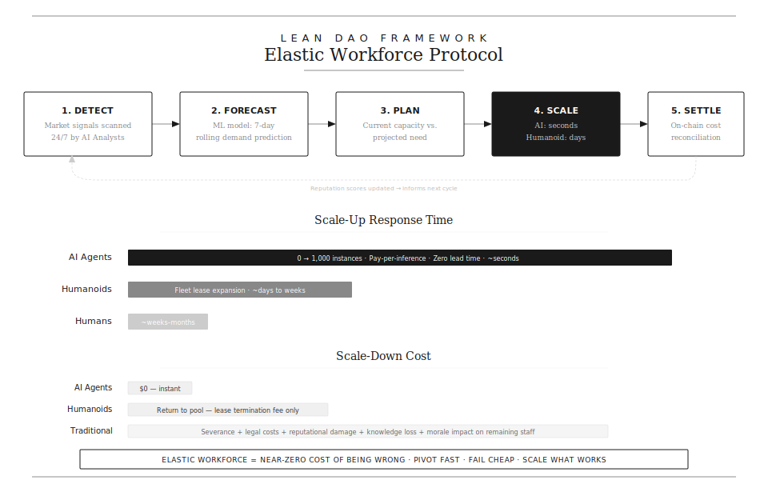
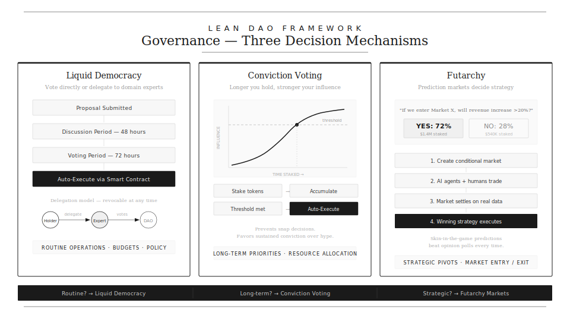
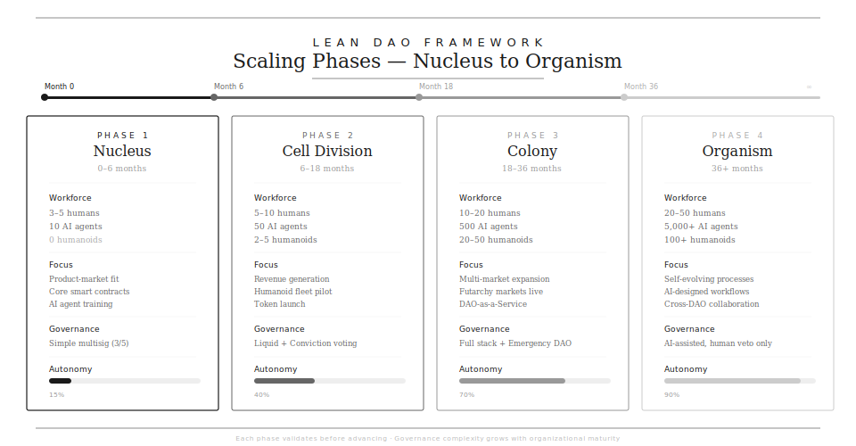

# LEAN DAO — Adaptive Autonomous Organization Framework

> A blueprint for building elastic, AI-native organizations combining DAO governance, AI software agents, and humanoid physical workers.

**Version 1.0** · March 2026

---

## Overview

The LEAN DAO framework defines a new organizational archetype: a Decentralized Autonomous Organization that employs both AI software agents and humanoid robots as its primary workforce, governed by on-chain smart contracts and token-based incentive alignment.

Unlike traditional companies with fixed headcount and hierarchical management, a LEAN DAO scales its workforce elastically in response to market signals — spinning up AI agents in seconds, leasing humanoid fleets on-demand, and making strategic decisions through prediction markets and liquid democracy.

**Core thesis:** The organization of the future has no employees — it has agents. Software agents for cognitive work, humanoid agents for physical work, and human overseers for ethical guardrails.

---

## System Architecture

The LEAN DAO operates across four layers: Protocol (L0), Orchestration (L1), Execution (L2), and Oversight (L3).

**L0 — Protocol Layer:** Smart contracts encoding governance rules, tokenomics, treasury management, and emergency shutdown. The immutable foundation.

**L1 — Orchestration Layer:** The AI Orchestrator — task decomposition, agent dispatch, resource optimization, market signal processing, and real-time KPI monitoring.

**L2 — Execution Layer:** Split between AI Agents (software workers scaling 0→1,000 in seconds) and Humanoid Fleet (physical workers on fleet lease models).

**L3 — Oversight Layer:** Human-in-the-loop for strategic direction, ethical review, and emergency override via 3/5 multisig with timelock.

---

## Elastic Workforce Protocol

The defining capability: scaling workforce to match demand in real-time with near-zero cost of being wrong.

The protocol runs in a continuous loop: **Detect** market signals → **Forecast** demand (ML, 7-day rolling) → **Plan** capacity → **Scale** up/down → **Settle** costs on-chain. Agent reputation scores update after each cycle.

### Scaling Speed

| Agent Type | Scale-Up Time | Scale-Down Cost |
|-----------|--------------|-----------------|
| AI Agents | ~seconds | $0 — instant terminate |
| Humanoids | ~days to weeks | Lease termination fee |
| Traditional employees | ~weeks to months | Severance + legal + knowledge loss |

---

## Governance Model

Three complementary mechanisms for different decision types, ensuring both speed and deliberation.

**Liquid Democracy** — Vote directly or delegate to domain experts. Delegation is revocable at any time. Best for routine operations, budgets, and policy changes.

**Conviction Voting** — The longer you hold your vote, the stronger your influence. Prevents snap decisions and favors sustained conviction. Best for long-term priorities and resource allocation.

**Futarchy** — Prediction markets decide strategy. AI agents and humans trade on conditional outcomes. Skin-in-the-game predictions beat opinion polls. Best for strategic pivots and market entry/exit decisions.

### Decision Routing

| Decision Type | Mechanism | Typical Timeline |
|--------------|-----------|-----------------|
| Routine operational | Liquid Democracy | 48h discussion + 72h vote |
| Long-term strategic | Conviction Voting | Continuous accumulation |
| Major pivot | Futarchy Markets | Market duration + 72h execution |
| Emergency | Emergency DAO | 3/5 multisig, immediate |

---

## Scaling Phases

From three founders to a self-evolving organism with thousands of agents.

| Phase | Timeline | Workforce | Autonomy |
|-------|---------|-----------|----------|
| **Nucleus** | 0–6 months | 3–5 humans, 10 AI agents | 15% |
| **Cell Division** | 6–18 months | 5–10 humans, 50 AI, 2–5 humanoids | 40% |
| **Colony** | 18–36 months | 10–20 humans, 500 AI, 20–50 humanoids | 70% |
| **Organism** | 36+ months | 20–50 humans, 5,000+ AI, 100+ humanoids | 90% |

Each phase validates before advancing. Governance complexity grows with organizational maturity.

---

## Four Foundational Principles

**1. Radical Elasticity** — Workforce = f(demand). The organization expands and contracts in real-time. Zero fixed personnel costs beyond the Core DAO Council.

**2. Token-Aligned Incentives** — Every agent (AI, humanoid, human) is compensated with tokens proportional to on-chain-measured value creation. Bad performance is penalized through slashing.

**3. Continuous Kaizen Loop** — Every process has a built-in feedback loop. AI agents propose optimizations, humanoids report anomalies, governance votes on changes. Toyota Production System at machine speed.

**4. Zero-Hierarchy Execution** — No managers. Smart contracts and agent consensus make operational decisions. Authority flows from capability and reputation, not org-chart position.

---

## Agent Taxonomy

### AI Agents (Software Workers)

| Role | Responsibilities | Scaling |
|------|-----------------|---------|
| Analyst | Data analysis, research, KPI monitoring | 0→1,000 in seconds |
| Developer | Code, review, deployment, CI/CD | Parallel multi-repo |
| Trading | Strategy execution, market making, risk | Multi-exchange simultaneous |
| Coordinator | Workflow orchestration, scheduling | 1 per workstream |
| Compliance | Regulatory monitoring, audit trail, KYC/AML | Always-on, multi-jurisdiction |

### Humanoid Robots (Physical Workers)

| Role | Responsibilities | Model |
|------|-----------------|-------|
| Operations | Equipment, logistics, inspection | Fleet lease quarterly |
| Client-Facing | Meetings, presentations, networking | On-demand rental |
| Security | Physical security, patrol, emergency | 24/7 rotation |
| Maintenance | Infrastructure, hardware, facilities | Shared pool |

### Human Overseers

| Role | Responsibilities | Model |
|------|-----------------|-------|
| DAO Council (5–9) | Strategy, emergency override, ethics | Token + vesting |
| Domain Expert | Specialist consultations, edge cases | Bounty per task |
| Auditor | Smart contract audit, AI review, QA | Retainer + rotation |

---

## Core Smart Contracts

| Contract | Function |
|----------|----------|
| `Constitution.sol` | Organizational charter, amendment process, fundamental constraints |
| `TreasuryManager.sol` | Automated budget: payroll, reinvestment, reserve management |
| `GovernanceEngine.sol` | Proposal submission, voting mechanics, execution triggers |
| `WorkAllocation.sol` | Task assignment via capability match, availability, cost optimization |
| `PerformanceOracle.sol` | On-chain oracle aggregating off-chain performance metrics |
| `FleetManager.sol` | Humanoid lease management: provisioning, rotation, maintenance |
| `EmergencyDAO.sol` | 3/5 multisig override with timelock for crisis scenarios |
| `ReputationRegistry.sol` | On-chain reputation scores for all agents |

---

## Risk & Resilience

### Circuit Breakers

| Trigger | Automatic Action |
|---------|-----------------|
| Treasury loss >5% in 24h | Freeze all trading agents, notify council |
| 3+ AI agents disagree on critical decision | Escalate to human review |
| Humanoid safety incident | Halt fleet in affected zone |
| Smart contract anomaly | Pause contract, activate Emergency DAO |
| Governance attack pattern | 7-day timelock on all proposals |
| Agent performance drops >30% | Quarantine agent, route to backup |

---

## KPI Targets

| Metric | Target |
|--------|--------|
| Time-to-Pivot | < 72 hours |
| Agent Utilization | > 85% |
| Cost-per-Task | ↓ 5% month-over-month |
| Decision Latency | < 24 hours |
| Fleet Elasticity Ratio | 3:1 |
| On-chain Transparency | 100% |

---

## Existing Precedents

| Project | What They Prove |
|---------|----------------|
| **Numerai** | AI-agent hedge fund with token staking works at $550M AUM (JPMorgan backed) |
| **AI16Z** | DAO + AI for venture capital decisions |
| **Figure AI + BMW** | Humanoid robots working factory shifts |
| **Tesla Optimus** | General-purpose humanoid at scale (targeting sub-$25K) |
| **1X NEO** | Consumer humanoid at $20K, shipping 2026 |
| **MakerDAO** | DAO governance at $8B+ scale |

**The gap:** No one has yet combined all three — DAO governance + AI agent workforce + humanoid physical workforce — into a single operating model.

---

## Documentation

See [`FRAMEWORK.md`](FRAMEWORK.md) for the complete technical specification including:
- Detailed technology stack (blockchain, AI infrastructure, humanoid integration, data layer)
- Financial model across all four phases
- Elastic Scaling Matrix for market signals
- Complete risk framework (AI, humanoid, governance, market risks)
- Phase 1 implementation blueprint (week-by-week)

---

## License

MIT

---

*This framework is a living document. The principles — radical elasticity, token alignment, continuous kaizen, and zero-hierarchy execution — remain constant across all adaptations.*
